## About me

I'm a high school student in Japan.  

I recently started programming after being inspired by a friend.  
I'm enjoying learning step by step and building small apps along the way.  

## Currently learning

- Android development

## Interests

- C/C++
- Competitive programming
- iOS development
- Backend development (Go?)

 

  <picture>
    <source media="(prefers-color-scheme: dark)" srcset="./assets/profile-cards/overview.dark.svg" />
    
  </picture>
   
   
  <picture>
    <source media="(prefers-color-scheme: dark)" srcset="./assets/profile-cards/top-langs-dark.svg" />
    
  </picture><picture>
    <source media="(prefers-color-scheme: dark)" srcset="./assets/profile-cards/wakatime-dark.svg" />
    
  </picture>

 
 

